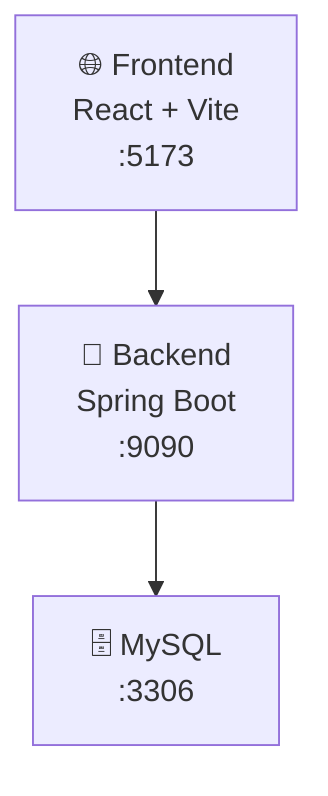

# 🚀 Phantask - Full Stack Task Management Application

Phantask is a full-stack application with a Spring Boot backend powering a React frontend. Both layers work independently but come together seamlessly to deliver a smooth task management experience.

# 🌐 Live Demo


Here 👉 http://65.0.74.98:5173/
#### Demo Credentials:
- username: demo
- password: Temp@123

---
## 🧱 Architecture Overview


---

## 🧠 Backend (Spring Boot)
The backend is the brain of Phantask 🧠 — handling authentication, authorization, business logic, and data persistence.
### ⚙️ Tech Stack
- Java17 + Spring Boot3.5.7
- Spring Security (JWT-based authentication 🔐)
- RESTful APIs
- JPA / Hibernate
- MySQL8
- Docker
---
## 🐳 Running with Docker

- Step 1: Start all services
```bash
sudo docker-compose up --build
```
- Step 2: Verify containers
```bash
sudo docker ps
```
### Expected containers:
```
phantask-mysql
phantask-backend
phantask-frontend
```
- Step 3: Check backend logs
```bash
sudo docker logs phantask-backend
```
#### Look for:
```bash
Tomcat initialized with port 9090
```
👉 This confirms backend is running correctly inside container

---
### 🌐 Backend Highlights

- Secure login & role-based access (ADMIN / USER)
- Clean layered architecture (Controller → Service → Repository)
- DTO-based responses for safe data transfer
- Stateless JWT authentication for scalability

---

## 🎨 Frontend(React)

The frontend is where Phantask comes to life ✨ — fast, responsive, and user-friendly.
### ⚙️ Tech Stack
- React
- Vite (⚡ lightning-fast dev server)
- Axios for API calls
- Modern component-based UI
---
### 🌟 Frontend Highlights
- Clean and responsive UI 📱💻
- Real-time interaction with backend APIs
- Secure token-based communication
- Smooth UX designed for productivity
---
## 🌐 Access Application
- Local: http://localhost:5173  
- Network (Mobile / Same WiFi): http://192.168.1.4:5173
---
### Test:
Signup, Login, API calls in browser DevTools → Network tab
#### 👉 Find your private IP:
```
- Linux / macOS: ip a or ifconfig
- Windows: ipconfig
```
### Mobile Testing:
- Signup, Login
- debug via:
  - chrome://inspect/#devices
---
## 🔗 How Frontend & Backend Work Together
💡 The magic happens here:
- React sends API requests using Axios
- Spring Boot validates JWT tokens 🔐
- Backend responds with structured JSON data
- Frontend updates UI instantly ⚡
---
## Both applications can run:
- On the same machine
- On different devices (as long as they’re on the same network 🌐)
---

### 🏆 Why Phantask?
1. Real-world full-stack architecture
2. Secure and scalable backend
3. Modern frontend workflow
4. Easy to run, easy to extend
5. Perfect for learning and showcasing skills
   
💼 Phantask isn’t just a project — it’s a production-style full-stack experience.

Built with care and real-world practices.
If Phantask added value to you, don’t forget to ⭐ the repository!

---
## 🔄 CI/CD Pipeline
Phantask includes a GitHub Actions workflow (`maven.yml`) to automate:
- Build  
- Test  
- Deployment readiness  
Workflow: [maven.yml](.github/workflows/maven.yml)
